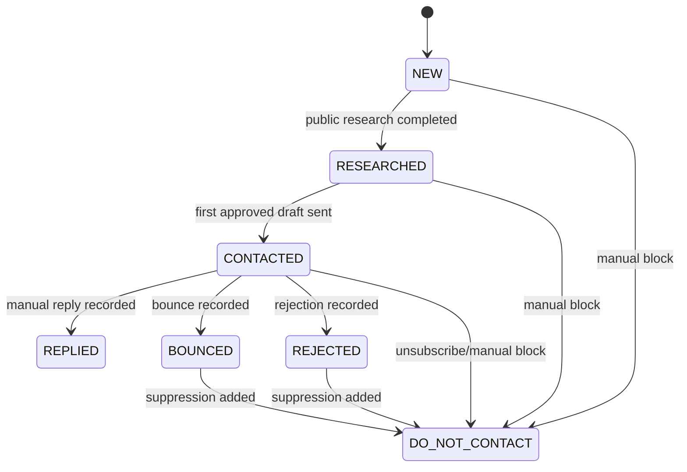
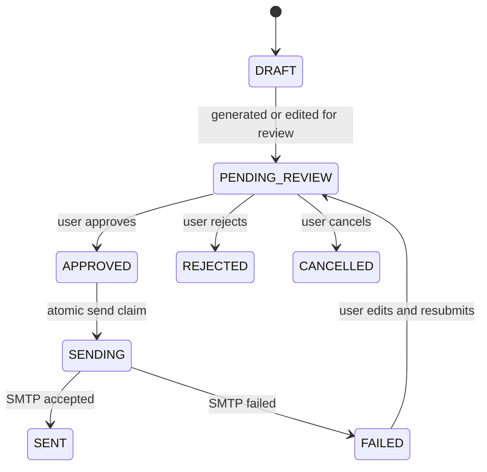

# Local Lead Development System Design

## Context

The existing project is a Next.js App Router website for Xingtai Jincong Rubber & Plastic Co., Ltd. It already has public marketing pages, product pages, bilingual content, and contact inquiry API routes. The customer development system must be isolated from the public website so that the company website remains stable and the outreach workflow can be reviewed before any real sending.

This design chooses a local-first implementation using SQLite and Prisma. It is intended for safe local use first, with a future migration path to PostgreSQL for Vercel or a server deployment.

## Goals

- Import potential manufacturing customer leads from CSV after preview and validation.
- Store company, region, industry, website, public contact information, product category, priority, research findings, contact verification state, draft emails, send history, suppression state, and follow-up state.
- Protect `/lead-dev` and `/api/lead-dev/*` with server-side authentication, not only hidden navigation.
- Fetch public website pages only when the user requests research, with SSRF protection and response limits.
- Generate a unique Chinese cooperation email draft for each lead based on public information and stored lead context.
- Store email drafts in a separate `EmailDraft` model and keep lead lifecycle state separate from draft review state.
- Require every email draft to pass through `PENDING_REVIEW` and manual approval before sending.
- Enforce conservative sending rules: `TEST_MODE=true` by default, one recipient per email, no BCC campaigns, daily cap of 8, server-side 3 to 8 minute interval check, no duplicate email sends, no invalid or unverified email sends, and one follow-up only after 5 working days without reply.
- Stop outreach after reply, bounce, rejection, unsubscribe, suppression, or do-not-contact marking.
- Provide a local admin interface with dashboard, lead list, lead detail, send queue, and follow-up center.

## Non-Goals

- No unsupervised bulk email sending.
- No long-running HTTP request that tries to send the entire queue.
- No CAPTCHA bypassing.
- No automated third-party form submission.
- No scraping private pages or pages blocked by normal public access.
- No downloading images, videos, archives, PDFs, Office documents, or other files during research.
- No claim that a prospect has an active purchasing requirement unless it is explicitly present in public material.
- No automatic reply detection from the mailbox in the first version. Replies, bounces, rejections, and unsubscribe requests will be manually recorded in the admin UI.
- No production SMTP sending until the user reviews the UI, test mode, and sending rules.

## Recommended Architecture

### Route Isolation

The system will live under `/lead-dev`.

- `/lead-dev/login`: single-admin login page.
- `/lead-dev`: dashboard.
- `/lead-dev/leads`: lead list, filters, CSV import, CSV export.
- `/lead-dev/leads/[id]`: lead detail, website research summary, matched plastic parts, draft history, approval controls.
- `/lead-dev/queue`: approved email drafts, daily quota, pause, stop-all, and send-next action.
- `/lead-dev/follow-ups`: leads eligible for one follow-up.
- `/lead-dev/suppression`: suppression list review and manual additions.

All backend endpoints will live under `/api/lead-dev/*` and will not reuse the public inquiry API.

### Directory Structure

- `prisma/schema.prisma`: Prisma schema for SQLite.
- `prisma/seed.ts`: initial ten companies and sample test data.
- `src/app/lead-dev/*`: admin pages.
- `src/app/api/lead-dev/*`: local admin API routes.
- `src/features/lead-dev/components/*`: admin UI components.
- `src/features/lead-dev/lib/auth.ts`: server-side auth, session cookie, password verification.
- `src/features/lead-dev/lib/*`: validation, status transitions, CSV parsing, SSRF-safe research, draft generation, sending rules, email transport, working-day helpers, and suppression checks.
- `src/features/lead-dev/data/*`: seed constants, email template rules, product-part mapping rules.
- `src/middleware.ts`: route-level auth gate for `/lead-dev` and `/api/lead-dev/*`.
- `src/app/robots.ts` or `public/robots.txt`: disallow `/lead-dev/` and `/api/lead-dev/`.
- `docs/lead-dev/README.md`: operator instructions.
- `.env.example`: extended with SMTP, admin auth, test mode, database, and sending window variables.
- `public/templates/lead-import-template.csv`: CSV template for imports.

## Access Control

The admin system is not public content. Access control is enforced server-side.

### Authentication Rules

- `/lead-dev` requires login. Unauthenticated browser requests redirect to `/lead-dev/login`.
- `/api/lead-dev/*` requires login. Unauthenticated API requests return `401`.
- Hiding links in the public website header is not considered security.
- Local MVP supports one administrator account.
- Admin credentials are configured through environment variables:
  - `LEAD_DEV_ADMIN_USERNAME`
  - `LEAD_DEV_ADMIN_PASSWORD_HASH`
  - `LEAD_DEV_SESSION_SECRET`
- The password hash is generated outside the source code. Plaintext passwords are never committed.
- Login creates a signed session cookie.
- Cookie attributes:
  - `HttpOnly=true`
  - `SameSite=Lax` for local MVP, with `SameSite=Strict` acceptable if it does not break local navigation
  - `Secure=true` in production
  - path limited to `/lead-dev`
  - finite max age
- Logout clears the cookie server-side.

### Indexing Rules

- All admin pages set `robots` metadata to `noindex, nofollow`.
- `robots.txt` disallows:
  - `/lead-dev/`
  - `/api/lead-dev/`
- Search indexing controls are not treated as authentication; they are only an additional privacy layer.

## Data Model

Lead lifecycle state and email review/send state are separated.

### Lead Lifecycle Status

`LeadStatus` only represents the customer lifecycle:

- `NEW`
- `RESEARCHED`
- `CONTACTED`
- `REPLIED`
- `BOUNCED`
- `REJECTED`
- `DO_NOT_CONTACT`

Follow-up due is computed from `lastContactedAt`, `hasFollowedUp`, lead status, draft state, and working-day rules. It is not stored as a lead status.

### Email Draft Status

`EmailDraftStatus` represents draft review and send state:

- `DRAFT`
- `PENDING_REVIEW`
- `APPROVED`
- `SENDING`
- `SENT`
- `FAILED`
- `REJECTED`
- `CANCELLED`

### Contact Verification Status

`ContactVerificationStatus`:

- `UNVERIFIED`
- `VERIFIED`
- `INVALID`
- `STALE`

Only `VERIFIED` email addresses can be approved or sent.

### Prisma Model Draft

```prisma
enum LeadStatus {
  NEW
  RESEARCHED
  CONTACTED
  REPLIED
  BOUNCED
  REJECTED
  DO_NOT_CONTACT
}

enum EmailDraftType {
  FIRST_TOUCH
  FOLLOW_UP
}

enum EmailDraftStatus {
  DRAFT
  PENDING_REVIEW
  APPROVED
  SENDING
  SENT
  FAILED
  REJECTED
  CANCELLED
}

enum EmailLogStatus {
  SENT
  FAILED
  SKIPPED
  CANCELLED
}

enum ContactVerificationStatus {
  UNVERIFIED
  VERIFIED
  INVALID
  STALE
}

enum SuppressionType {
  EMAIL
  DOMAIN
}

enum SuppressionReason {
  UNSUBSCRIBE
  REJECTED
  BOUNCED
  MANUAL
}

model Lead {
  id                        String                    @id @default(cuid())
  companyName               String
  region                    String?
  industry                  String?
  website                   String?
  publicEmail               String?
  publicPhone               String?
  contactPerson             String?
  sourceUrl                 String?
  priority                  String?                   @default("MEDIUM")
  productCategory           String?
  productSummary            String?
  potentialPlasticParts     String?
  personalizationReason     String?
  status                    LeadStatus                @default(NEW)
  contactVerifiedAt         DateTime?
  contactVerificationStatus ContactVerificationStatus @default(UNVERIFIED)
  contactSourceUrl          String?
  lastResearchAt            DateTime?
  websiteSnapshot           String?
  lastContactedAt           DateTime?
  repliedAt                 DateTime?
  hasFollowedUp             Boolean                   @default(false)
  doNotContactReason        String?
  notes                     String?
  createdAt                 DateTime                  @default(now())
  updatedAt                 DateTime                  @updatedAt

  drafts                    EmailDraft[]
  logs                      EmailLog[]

  @@index([companyName])
  @@index([publicEmail])
  @@index([status])
  @@index([contactVerificationStatus])
}

model EmailDraft {
  id           String           @id @default(cuid())
  leadId       String
  lead         Lead             @relation(fields: [leadId], references: [id], onDelete: Cascade)
  type         EmailDraftType
  recipient    String
  subject      String
  body         String
  status       EmailDraftStatus @default(DRAFT)
  version      Int              @default(1)
  idempotencyKey String         @unique
  approvedAt   DateTime?
  sentAt       DateTime?
  createdAt    DateTime         @default(now())
  updatedAt    DateTime         @updatedAt

  logs         EmailLog[]

  @@index([leadId])
  @@index([status])
  @@unique([leadId, type, version])
}

model EmailLog {
  id              String         @id @default(cuid())
  leadId          String
  lead            Lead           @relation(fields: [leadId], references: [id], onDelete: Cascade)
  draftId         String?
  draft           EmailDraft?    @relation(fields: [draftId], references: [id], onDelete: SetNull)
  type            EmailDraftType
  intendedRecipient String
  actualRecipient String
  subject         String
  body            String
  status          EmailLogStatus
  testMode        Boolean
  smtpUser        String?
  errorMessage    String?
  idempotencyKey  String         @unique
  sentAt          DateTime?
  createdAt       DateTime       @default(now())

  @@index([leadId])
  @@index([draftId])
  @@index([createdAt])
}

model SuppressionList {
  id        String            @id @default(cuid())
  type      SuppressionType
  value     String
  reason    SuppressionReason
  sourceLeadId String?
  notes     String?
  createdAt DateTime          @default(now())

  @@unique([type, value])
  @@index([value])
}

model SystemSetting {
  id                       String   @id @default("lead-dev")
  testMode                 Boolean  @default(true)
  paused                   Boolean  @default(false)
  stopAllSending           Boolean  @default(false)
  dailySendLimit           Int      @default(8)
  minSendIntervalMinutes   Int      @default(3)
  maxSendIntervalMinutes   Int      @default(8)
  sendWindowStart          String   @default("09:00")
  sendWindowEnd            String   @default("17:30")
  timezone                 String   @default("Asia/Shanghai")
  lastSentAt               DateTime?
  updatedAt                DateTime @updatedAt
}
```

The original user-requested `emailSubject` and `emailBody` values are not stored as the source of truth on `Lead`; they live in `EmailDraft`.

## Status Flow

### Lead Lifecycle



### Email Draft Lifecycle



### Follow-Up Eligibility

Follow-up due is computed, not stored as a lead status. A lead is eligible only when:

- `Lead.status = CONTACTED`.
- `Lead.repliedAt` is empty.
- `Lead.hasFollowedUp = false`.
- No draft of type `FOLLOW_UP` is already `APPROVED`, `SENDING`, or `SENT`.
- At least 5 working days have elapsed since `lastContactedAt`.
- Lead email remains verified.
- Lead email and domain are not in `SuppressionList`.

## CSV Import and Export

The CSV importer accepts exactly these columns:

- `companyName`
- `region`
- `industry`
- `website`
- `publicEmail`
- `publicPhone`
- `contactPerson`
- `sourceUrl`
- `priority`
- `productCategory`
- `notes`

Import security rules:

- Import requires admin authentication.
- `companyName` is required.
- File size is limited. MVP limit: 1 MB.
- Row count is limited. MVP limit: 1,000 data rows per import.
- Encoding must be UTF-8 with optional UTF-8 BOM.
- Column names must match the expected set. Unknown columns and missing required columns fail validation.
- Formula injection is neutralized on import and export for cells starting with `=`, `+`, `-`, `@`, tab, or carriage return. Exported risky cells are prefixed with a single quote.
- Import first creates a preview containing valid rows, duplicate rows, invalid emails, missing required fields, and suppression conflicts.
- No import operation can generate a draft, approve a draft, or send email.
- Duplicate detection uses normalized `companyName`, `website`, and `publicEmail`.
- Invalid email formats are stored with `contactVerificationStatus=INVALID` and cannot be approved or sent.
- Missing public email is allowed because the lead may still be researched, but sending is blocked until a verified email is added.

Export rules:

- Export includes lead fields, lifecycle status, verification status, notes, research summary, last contact time, and computed follow-up state.
- Email drafts and email logs are exported separately to keep audit history clear.
- Export applies formula-injection protection to every text cell.

## Contact Verification

Contact data must be verified before email approval.

Rules:

- `contactVerificationStatus=UNVERIFIED` by default.
- User must provide or confirm `contactSourceUrl` before marking an email as `VERIFIED`.
- `contactVerifiedAt` is set when status becomes `VERIFIED`.
- `STALE` can be used when an email was once verified but has not been checked recently.
- Approval is blocked unless the recipient email is valid, `VERIFIED`, and not suppressed.
- Sending rechecks verification immediately before the atomic `APPROVED -> SENDING` transition.

## Public Website Research

Research is user-triggered per lead. The API fetches the public website homepage or `sourceUrl`, extracts readable text, and limits stored text to a concise snapshot.

### SSRF Protection

Before any request:

- Only `http:` and `https:` URLs are allowed.
- `file:`, `ftp:`, `gopher:`, `data:`, and every other protocol are rejected.
- Hostnames are resolved and checked.
- `localhost`, loopback addresses, private IP ranges, link-local ranges, multicast ranges, and cloud metadata addresses are blocked.
- Blocked address examples include `127.0.0.0/8`, `::1`, `10.0.0.0/8`, `172.16.0.0/12`, `192.168.0.0/16`, `169.254.0.0/16`, `fe80::/10`, and `169.254.169.254`.
- Redirect targets are revalidated with the same rules.
- Redirect count is limited. MVP limit: 3 redirects.
- Request timeout is limited. MVP limit: 8 seconds.
- Response body size is limited. MVP limit: 1 MB.
- Accepted content types are `text/html`, `text/plain`, or missing content type with a text-like response.
- Image, video, archive, PDF, Office, binary, and attachment responses are not downloaded or parsed.

Extraction rules:

- Do not log in.
- Do not bypass CAPTCHA.
- Do not submit forms.
- Do not crawl aggressively.
- Store failures as notes without blocking manual editing.

The first version uses deterministic extraction and rule-based summarization rather than an external AI API. It searches public text for industry/product clues such as children vehicles, electronics, furniture, pet products, automotive parts, hardware, housings, plugs, caps, clips, washers, and accessories. This keeps the system deployable without secret AI keys.

## Email Draft Generation

Draft generation is deterministic and template-based with lead-specific insertion. It creates or updates an `EmailDraft`; it does not write the canonical subject/body to `Lead`.

Draft inputs:

- Company name.
- Public product summary.
- Industry and region.
- Potential plastic parts matched from rules.
- Verified recipient email.
- Jincong capability statements.
- Company website.

The draft body must include:

1. Target company name.
2. Specific products from public website or imported lead context.
3. One to three possible plastic parts.
4. Jincong capabilities: drawing-based customization, sample-based customization, injection molding, sample trial, small batch, and batch production.
5. Website: `https://www.jincongplastic.com`.
6. Request to forward to purchasing, production, or product development if the reader is not responsible.
7. Simple opt-out sentence.

Draft limits:

- First email body: 250 to 400 Chinese characters where practical.
- Natural and professional tone.
- No unsupported claims about equipment, certifications, customer cases, factory scale, price guarantees, or guaranteed lead time.
- Drafts are never sent directly after generation; they enter `PENDING_REVIEW`.

## Sending Workflow

### First Email

Allowed high-level flow:

1. Lead is imported as `NEW`.
2. User researches public website; lead becomes `RESEARCHED`.
3. User verifies contact email; lead keeps lifecycle status but contact becomes `VERIFIED`.
4. System generates a `FIRST_TOUCH` `EmailDraft`.
5. Draft moves `DRAFT -> PENDING_REVIEW`.
6. User edits and approves; draft moves `PENDING_REVIEW -> APPROVED`.
7. User clicks “send next approved email”.
8. Server atomically claims one draft: `APPROVED -> SENDING`.
9. On SMTP success: draft becomes `SENT`, lead becomes `CONTACTED`, `lastContactedAt` is set, and an `EmailLog` row is written.
10. On SMTP failure: draft becomes `FAILED`, lead remains unchanged, and an `EmailLog` row is written.

Before approval, the detail page displays:

- Intended recipient.
- Contact verification status and source URL.
- Subject.
- Body.
- Public matching basis.
- Test mode destination.
- Current daily quota and sending window.

Before sending, the server revalidates:

- Admin session is valid.
- Draft status is `APPROVED`.
- Lead status is not `REPLIED`, `BOUNCED`, `REJECTED`, or `DO_NOT_CONTACT`.
- Sending is not paused.
- Stop-all-sending is not enabled.
- Current time is Monday to Friday between 09:00 and 17:30 in `Asia/Shanghai`.
- Daily limit is not exceeded.
- Last send was at least the configured randomized interval ago.
- Recipient format is valid.
- Contact verification is `VERIFIED`.
- Recipient email and domain are not suppressed.
- Same email address has not already been sent a `FIRST_TOUCH`.
- In test mode, actual recipient is `TEST_RECIPIENT`.

### Follow-Up

Follow-up generation creates one reviewable `FOLLOW_UP` draft and sends only after approval. After successful follow-up send:

- The follow-up draft becomes `SENT`.
- `Lead.hasFollowedUp` becomes `true`.
- `Lead.lastContactedAt` updates to the follow-up send time.
- Lead remains `CONTACTED` unless manually moved to reply, bounce, rejection, or do-not-contact.

### Stop Conditions

The UI can mark a lead as:

- `REPLIED`
- `BOUNCED`
- `REJECTED`
- `DO_NOT_CONTACT`

When a lead is marked `BOUNCED`, `REJECTED`, or `DO_NOT_CONTACT`, the relevant email or domain is added to `SuppressionList` when available. Any of those statuses blocks future sending.

## Queue Behavior

Local MVP does not include an automatic complete queue runner.

The queue page provides:

- “Send next approved email”: sends at most one `APPROVED` draft.
- Pause/resume.
- Stop all sending.
- Daily quota display.
- Last send time and next allowed send time.

There is no “run full queue” button in the MVP. A future automated queue must use a separate worker or reliable task queue, not a long-running HTTP request.

## Duplicate Prevention and Concurrency Locking

Sending uses atomic state transitions.

Required server behavior:

- Select one eligible `EmailDraft` with `status=APPROVED`.
- Atomically update it to `SENDING` only if it is still `APPROVED`.
- If the update count is zero, another request already claimed it and the current request exits without sending.
- Use `idempotencyKey` on `EmailDraft` and `EmailLog`.
- `EmailLog.idempotencyKey` is unique.
- A draft that reaches `SENT` cannot be sent again.
- Continuous clicks and concurrent requests cannot create duplicate sends.
- The duplicate email check happens before claim and again inside the transaction.

## Working Day and Sending Time Rules

Default sending window:

- Monday to Friday.
- 09:00 to 17:30.
- Timezone: `Asia/Shanghai`.

Rules:

- Sending outside the window is blocked server-side.
- Follow-up due calculation counts working days only.
- The 3 to 8 minute interval is checked server-side using `SystemSetting.lastSentAt`.
- The actual interval value is chosen and stored after each send attempt so the UI can show the next allowed time.

## Suppression List

`SuppressionList` is permanent outreach safety data.

Rules:

- Suppression survives lead deletion.
- Suppression can be for an exact email or a domain.
- Reasons include unsubscribe, rejection, bounce, or manual block.
- Approval and sending both check suppression.
- CSV import flags rows that match suppression.
- Manual additions are available from `/lead-dev/suppression`.

## Email Transport

Nodemailer sends email through environment variables:

- `SMTP_HOST`
- `SMTP_PORT`
- `SMTP_SECURE`
- `SMTP_USER`
- `SMTP_PASS`
- `FROM_NAME`
- `FROM_EMAIL`
- `COMPANY_WEBSITE`
- `TEST_RECIPIENT`
- `TEST_MODE`
- `DATABASE_URL`
- `LEAD_DEV_ADMIN_USERNAME`
- `LEAD_DEV_ADMIN_PASSWORD_HASH`
- `LEAD_DEV_SESSION_SECRET`

Default local `.env` values:

- `TEST_MODE=true`
- `DATABASE_URL=file:./dev.db`
- `FROM_NAME=邢台锦聪橡塑有限公司`
- `COMPANY_WEBSITE=https://www.jincongplastic.com`

In test mode, all email is sent only to `TEST_RECIPIENT`, while the original public email is shown in the log as the intended recipient.

## Safety and Compliance Rules

- Server-side auth protects all admin pages and APIs.
- Admin pages are `noindex,nofollow`.
- `robots.txt` disallows admin routes.
- No BCC sending.
- One email per recipient per send action.
- Daily cap is 8.
- Server-side send interval is 3 to 8 minutes.
- Local MVP sends at most one approved draft per click.
- “Stop all sending” immediately blocks future sends at the API level.
- Logs never include SMTP password, tokens, or authorization codes.
- Failed sends keep the draft and lead data intact.
- Invalid, unverified, stale, or suppressed recipient emails are blocked before SMTP.
- Duplicate public emails are blocked before approval and before send.

## Admin Pages

### Dashboard

Cards:

- Total leads.
- Pending research.
- Unverified contacts.
- Pending review drafts.
- Approved drafts.
- Sent today.
- Replied.
- Computed follow-up due.
- Bounced.
- Suppressed.

### Login

Features:

- Single-admin username and password.
- Server-side password verification.
- HttpOnly session cookie.
- Logout.
- Generic invalid login error.

### Lead List

Features:

- Search by company name.
- Filter by region, industry, priority, lead lifecycle status, and contact verification status.
- Duplicate warning.
- CSV import preview.
- CSV export.
- Suppression warning.
- Quick status badge.

### Lead Detail

Sections:

- Company and source information.
- Contact verification controls.
- Website research summary.
- Potential plastic parts.
- Personalization reason.
- Email draft history.
- Draft editor and review controls.
- Approve, reject, cancel, and do-not-contact actions.
- Email log timeline.

### Send Queue

Sections:

- Approved drafts.
- Test mode banner.
- Daily quota.
- Sending window.
- Pause/resume.
- Stop all sending.
- Send next approved email.
- Queue log.

### Follow-Up Center

Sections:

- Leads eligible after 5 working days.
- Generate follow-up draft.
- Review before approval.
- One follow-up maximum warning.

### Suppression List

Sections:

- Suppressed emails and domains.
- Reason and source lead.
- Manual add form.
- Import conflict indicators.

## Initial Seed Leads

The seed file includes these companies with `status=NEW`, `contactVerificationStatus=UNVERIFIED`, and `notes` indicating that contact details must be revalidated before sending:

1. 河北恒驰自行车零件集团有限公司
2. 河北贝儿佳儿童用品有限公司
3. 河北红思达车业有限公司
4. 河北库比车业有限公司
5. 河北盛马电子科技有限公司
6. 河北蓝鸟家具股份有限公司
7. 荣喜宠物食品有限公司
8. 邢台诺德宠物用品有限公司
9. 河北酷贝宠物用品有限公司
10. 清河县利国汽车配件有限公司

## Testing Strategy

Automated checks:

- Auth tests:
  - unauthenticated `/lead-dev` redirects to login.
  - unauthenticated `/api/lead-dev/*` returns `401`.
  - session cookie is `HttpOnly` and has `SameSite`.
- Robots and metadata tests:
  - admin pages include `noindex,nofollow`.
  - robots disallows `/lead-dev/` and `/api/lead-dev/`.
- Data model tests:
  - lead lifecycle status is separate from draft status.
  - draft version uniqueness works.
  - suppression unique constraints block duplicate suppression rows.
- CSV tests:
  - strict column validation.
  - file size and row count limits.
  - formula injection neutralization on import and export.
  - preview does not create drafts or send mail.
- Contact verification tests:
  - unverified, invalid, stale, and missing emails cannot be approved or sent.
  - verified email requires `contactSourceUrl`.
- SSRF tests:
  - rejects non-http protocols.
  - rejects localhost, loopback, private IPs, link-local, and metadata IPs.
  - revalidates redirect targets.
  - enforces timeout, redirect count, body size, and content type.
- Draft tests:
  - generated draft includes company name, product summary, plastic parts, website, forwarding request, and opt-out text.
  - first-touch and follow-up drafts are separate types.
- Send guard tests:
  - no invalid email.
  - no unverified email.
  - no suppressed email or domain.
  - no unapproved send.
  - no do-not-contact send.
  - no quota bypass.
  - no sending outside Monday to Friday 09:00 to 17:30.
  - no non-test recipient in test mode.
  - no duplicate send on repeated or concurrent requests.
  - `APPROVED -> SENDING -> SENT/FAILED` transition is atomic.
- Follow-up tests:
  - due after 5 working days only.
  - no follow-up after reply, bounce, rejection, or do-not-contact.
  - only one follow-up per lead.
- Project checks:
  - `npm run typecheck`.
  - `npm run lint`.
  - `npm run build`.

Manual local checks:

- Login required before opening admin pages.
- Import CSV template and inspect preview before commit.
- Open each admin page.
- Research a seeded lead without downloading files.
- Verify contact source URL manually.
- Generate a draft for a seeded lead.
- Edit and approve a draft.
- Confirm queue shows test mode and intended recipient.
- Send only one approved draft to `TEST_RECIPIENT`.
- Click send repeatedly and confirm no duplicate sends.
- Mark reply, bounce, rejection, and do-not-contact and confirm future sends are blocked.
- Add email/domain to suppression and confirm approval/send is blocked.

## Deployment Path

Local first:

- SQLite database through `DATABASE_URL=file:./dev.db`.
- Run Prisma migration locally.
- Use `TEST_MODE=true`.
- Use one local admin account.

Future Vercel or server:

- Replace SQLite with PostgreSQL.
- Set `DATABASE_URL` to PostgreSQL.
- Keep `TEST_MODE=true` until reviewed.
- Add SMTP and admin auth environment variables in hosting provider.
- Keep `/lead-dev` routes protected by server-side auth.

## Acceptance Criteria

- The public website pages continue to work.
- The lead development system is reachable only under `/lead-dev` and protected by server-side login.
- `/api/lead-dev/*` returns `401` when unauthenticated.
- Admin pages are `noindex,nofollow`, and robots disallows admin routes.
- CSV import previews first, validates columns, avoids duplicates, prevents formula injection, and never creates drafts or sends mail.
- Seed leads are present with unverified contacts.
- Research stores a public summary with SSRF protections and no file downloads.
- Draft generation creates per-lead Chinese `EmailDraft` rows and never sends automatically.
- Lead lifecycle state and draft state remain separate.
- Every outbound email requires verified contact and approved draft.
- Test mode is on by default and forces sends to `TEST_RECIPIENT`.
- The queue sends at most one approved draft per click.
- The queue respects daily cap, working hours, interval, duplicate prevention, suppression, stop-all, pause, and status blocks.
- Concurrent clicks cannot send the same draft twice.
- Follow-up appears only after 5 working days and only once per company.
- Logs record send attempts without exposing SMTP secrets.
- README, `.env.example`, CSV template, Prisma schema, seed data, and tests are included.
